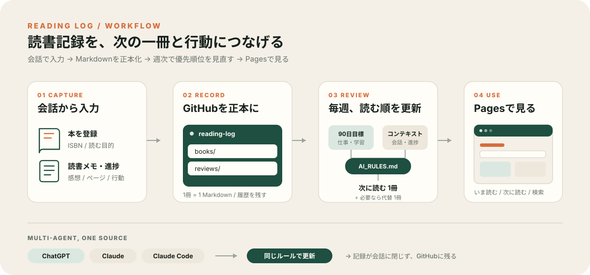

# Reading Log

読書記録を「残す」だけで終わらせず、**次に読む本と、読後にやることまでつなげる**ための個人用システムです。

**[GitHub Pages で本棚を見る →](https://n-yoshida-dev.github.io/reading-log/)**



## 何をしているか

- **会話から記録** — 本の登録、進捗、メモ、感想をChatGPT / Claude経由で追加
- **GitHubを正本にする** — 1冊1Markdownで、会話に閉じず履歴を残す
- **読む順番を毎週見直す** — 90日目標、現在の課題、読書進捗、会話コンテキストから次の1冊を選ぶ
- **AIごとの判断を揃える** — `AI_RULES.md` をChatGPT / Claude / Claude Code共通の運用ルールにする
- **GitHub Pagesで読む** — 「いま読む」「次に読む」「すべての本」、検索・絞り込み・並べ替え、各本の詳細を表示

単なる読了リストではなく、**入力 → 記録 → 週次レビュー → 次の読書 → 行動**を1つの流れとして扱うのが目的です。

## 構成

| 役割 | 使っているもの |
| --- | --- |
| 日常の入力・相談 | ChatGPTプロジェクト「読書管理」 |
| 正本 | このGitHubリポジトリ |
| 大量登録・構造変更 | Claude Code |
| 共通ルール | [`AI_RULES.md`](AI_RULES.md) |
| 週次レビュー | [`reviews/latest.md`](reviews/latest.md) |
| 閲覧 | [GitHub Pages](https://n-yoshida-dev.github.io/reading-log/) |

```text
reading-log/
├── books/        # 1冊につき1ファイル
├── inbox/        # 未整理の入力
├── reviews/      # 週次レビュー
├── templates/    # 登録・レビュー用テンプレート
├── AI_RULES.md   # 全AI共通の運用ルール
└── index.html    # GitHub Pagesの本棚
```

## 読む順番の決め方

週次レビューでは、単純な「読みたい順」ではなく、主に次を見ます。

1. 現在の90日目標に直結するか
2. 仕事・開発・資格学習・生活上の課題を前進させるか
3. 読みかけを完了する価値があるか
4. 今週の時間で有効な区切りまで進められるか
5. 先に実行すべき読後アクションが残っていないか

主提案は原則1冊。必要なときだけ代替を1冊出し、決定後は各本の `reading_order` に反映します。

## 記録で重視していること

- 読書メモは日付順に追記し、過去の自分の記述を勝手に要約・削除しない
- AIの要約と、自分自身の感想・理解を混同しない
- 読了を目的化せず、`paused` / `skimmed` / `abandoned` も正常な判断として扱う
- 公開リポジトリなので、個人情報・業務機密・書籍本文の長い引用は残さない

詳細な運用仕様は [`AI_RULES.md`](AI_RULES.md) にまとめています。

## このリポジトリについて

現時点では**自分の読書運用に合わせた個人用システム**として整備しており、汎用ツールとしての導入手順は用意していません。

外部からのIssue / Pull Requestを前提としたプロジェクトではありません。